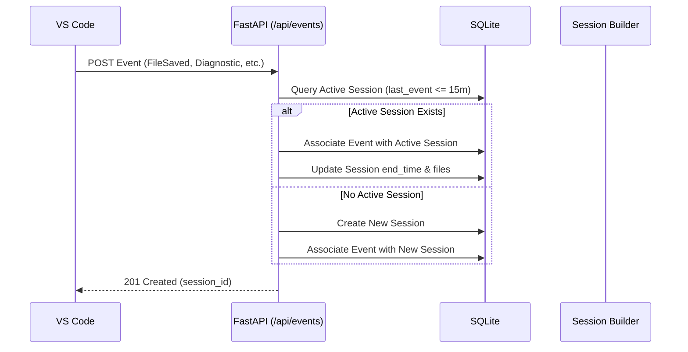
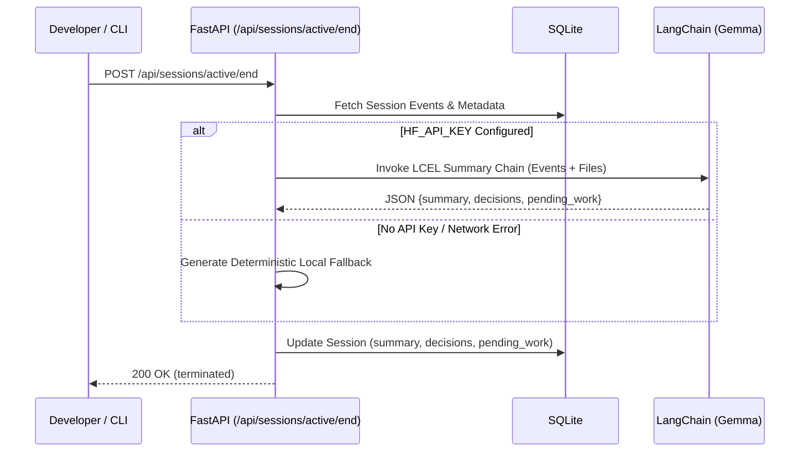

# Developer Memory OS
## System Architecture

Version: 1.0  
Status: Active  

---

## 1. System Overview

Developer Memory OS is a local-first, CLI-driven developer memory system. It continuously captures granular development signals (file modifications, diagnostics, git commits, workspace changes) from the editor, automatically groups them into temporal work sessions, derives structured AI summaries, and exposes natural language querying and instant context restoration via a fast terminal interface.

```
┌──────────────────────────────────────────────────────────┐
│                   VS Code Extension                      │
│   (Captures: FileSaved, FileOpened, Diagnostic, Git)     │
└────────────────────────────┬─────────────────────────────┘
                             │ HTTP POST /api/events
                             │ (with 3x retry & backoff)
                             ▼
┌──────────────────────────────────────────────────────────┐
│               FastAPI Backend (Port 8000)                │
│                                                          │
│  ┌────────────────────┐       ┌───────────────────────┐  │
│  │   Event Ingestion  │       │    Session Builder    │  │
│  │    & Validation    │──────▶│ (15-min timeout rule) │  │
│  └────────────────────┘       └───────────┬───────────┘  │
│                                           │              │
│  ┌────────────────────┐       ┌───────────▼───────────┐  │
│  │ Natural Language   │       │   Summary Generator   │  │
│  │   Search Service   │       │  (LangChain + Gemma)  │  │
│  └──────────┬─────────┘       └───────────┬───────────┘  │
│             │                             │              │
│             └──────────────┬──────────────┘              │
│                            ▼                             │
│                  ┌───────────────────┐                   │
│                  │  SQLite Database  │                   │
│                  │ (events, sessions)│                   │
│                  └───────────────────┘                   │
└────────────────────────────▲─────────────────────────────┘
                             │
                             │ REST API Queries
                             │ (/api/search, /api/sessions)
┌────────────────────────────┴─────────────────────────────┐
│                       devmem CLI                         │
│  Commands: history, sessions, resume, ask, search,       │
│            health, version                               │
└──────────────────────────────────────────────────────────┘
```

---

## 2. Component Architecture

### A. Event Collector (VS Code Extension)
- **Engine**: TypeScript running in VS Code Extension Host.
- **Event Listeners**:
  - `workspace.onDidOpenTextDocument` ➔ `FileOpened`
  - `workspace.onDidSaveTextDocument` ➔ `FileSaved`
  - `workspace.onDidCloseTextDocument` ➔ `FileClosed`
  - `languages.onDidChangeDiagnostics` ➔ `Diagnostic` (filtered to Error and Warning)
  - `workspace.onDidChangeWorkspaceFolders` ➔ `WorkspaceOpened` / `WorkspaceClosed`
- **Filtering**: Automatically excludes `.git/`, `node_modules/`, and internal VS Code schemes (`output:`, `extension-output:`, `git:`, `debug:`).
- **HTTP Transport**: `client.ts` with resilient retry strategy (3 attempts, 1s exponential backoff) sending payloads to `POST /api/events`.

### B. Ingestion & Session Management (FastAPI Backend)
- **Event Storage**: Validates incoming JSON against Pydantic models and records to SQLite.
- **Session Clustering**:
  - Automatically matches events to an active session for the same workspace if `event.timestamp - session.last_event_time <= 15 minutes`.
  - Creates a new session if no active session exists or timeout is exceeded.
  - Keeps the list of touched files unique and updated.
- **Session Finalization**:
  - On explicit session end (`POST /api/sessions/active/end`) or timeout, triggers the AI summarization pipeline.

### C. AI Summarization & Search Engine (LangChain + Gemma)
- **Model**: Google Gemma via Hugging Face Inference API (`ChatHuggingFace` + `HuggingFaceEndpoint`).
- **Structured Parsing**: `JsonOutputParser` with Pydantic schema validation for:
  - `summary`: One-sentence summary of the task.
  - `decisions`: Bulleted list of choices and file modifications.
  - `pending_work`: Actionable next steps and unresolved diagnostics.
- **Natural Language Q&A**: LCEL chain processing session context to answer developer questions.
- **Offline Deterministic Fallback**: In the absence of an API key or during network unavailability, a deterministic heuristic engine formats metadata, commit logs, and diagnostics with 100% offline reliability.

### D. Command Line Interface (`devmem`)
- **Engine**: Python `typer` + `rich` console formatting.
- **Commands**:
  - `devmem history`: Chronological view of past sessions with pagination.
  - `devmem sessions`: Real-time inspection of active and past sessions.
  - `devmem resume`: Restores immediate working context, files, decisions, and TODOs.
  - `devmem ask "<question>"`: Natural-language query interface.
  - `devmem search "<query>"`: Keyword and date-filtered session lookup.
  - `devmem health`: Backend service and database health check.
  - `devmem version`: Displays client and configuration metadata.

---

## 3. Data Flow

### Event Ingestion Flow


### Session Finalization & AI Summarization Flow


---

## 4. Technology Stack

| Layer | Technology | Rationale |
|---|---|---|
| **Backend Framework** | FastAPI + Uvicorn | High performance, native async, automatic OpenAPI docs |
| **ORM & Migrations** | SQLAlchemy + Alembic | Declarative schema, robust migration tracking |
| **Database** | SQLite | Local-first, zero setup, portable, single-file storage |
| **AI Orchestration** | LangChain + ChatHuggingFace | Composable LCEL chains, structured output parsing |
| **LLM Model** | Google Gemma | Efficient, accurate reasoning for developer context |
| **CLI Framework** | Typer + Rich | Modern Python CLI with colored terminal tables and panels |
| **IDE Extension** | TypeScript + VS Code API | Standard ecosystem, non-intrusive background telemetry |
| **Testing** | Pytest, Mocha, Subprocess E2E | Multi-tier test verification covering all layers |